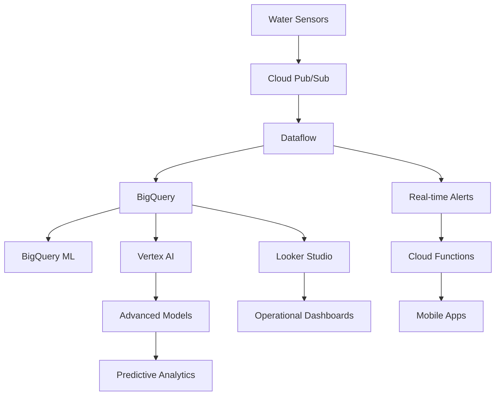

# 🚀 **GCP Advanced Analytics for Water Infrastructure**

Complete guide to leveraging Google Cloud Platform for advanced data analysis, machine learning, and visualization of your water infrastructure data.

## 📊 **1. Looker Studio (FREE) - Instant Dashboards**

### **Quick Setup:**
1. Go to [`datastudio.google.com`](https://datastudio.google.com)
2. Create → Data Source → BigQuery
3. Select: `abbanoa-464816.water_infrastructure.sensor_data`

### **Recommended Dashboard Components:**

#### **🔥 Real-Time KPI Cards**
```sql
-- Current Flow Rate
SELECT 
  selargius_nodo_via_sant_anna_portata_w_istantanea_diretta as current_flow
FROM `abbanoa-464816.water_infrastructure.sensor_data` 
ORDER BY _ingestion_timestamp DESC 
LIMIT 1
```

#### **📈 Time Series Charts**
- **X-axis**: `DATETIME(PARSE_DATE('%d/%m/%Y', data), PARSE_TIME('%H:%M:%S', ora))`
- **Y-axis**: Flow rates, temperatures, pressures
- **Benefits**: Interactive zoom, drill-down, real-time updates

#### **🔥 Consumption Heatmap**
- **Rows**: `EXTRACT(DAYOFWEEK FROM PARSE_DATE('%d/%m/%Y', data))`
- **Columns**: `EXTRACT(HOUR FROM PARSE_TIME('%H:%M:%S', ora))`
- **Color**: `AVG(selargius_nodo_via_sant_anna_portata_w_istantanea_diretta)`

---

## 🧠 **2. BigQuery ML - Built-in Machine Learning**

### **✅ Already Created: Time Series Forecasting Model**
```sql
-- Use the model to predict next 7 days
SELECT *
FROM ML.FORECAST(MODEL `abbanoa-464816.water_infrastructure.flow_forecasting_model`,
                 STRUCT(168 AS horizon, 0.8 AS confidence_level))
```

### **🔮 Anomaly Detection Model**
```sql
CREATE OR REPLACE MODEL `abbanoa-464816.water_infrastructure.anomaly_detector`
OPTIONS(
  model_type='AUTOENCODER',
  activation_fn='RELU',
  hidden_units=[32, 16, 8, 16, 32]
) AS
SELECT
  selargius_nodo_via_sant_anna_portata_w_istantanea_diretta as flow_1,
  selargius_serbatoio_selargius_portata_uscita as output_flow,
  EXTRACT(HOUR FROM PARSE_TIME('%H:%M:%S', ora)) as hour_feature
FROM `abbanoa-464816.water_infrastructure.sensor_data`
WHERE selargius_nodo_via_sant_anna_portata_w_istantanea_diretta IS NOT NULL
```

### **🎯 Clustering for Operational Patterns**
```sql
CREATE OR REPLACE MODEL `abbanoa-464816.water_infrastructure.usage_patterns`
OPTIONS(model_type='KMEANS', num_clusters=5) AS
SELECT
  EXTRACT(HOUR FROM PARSE_TIME('%H:%M:%S', ora)) as hour,
  EXTRACT(DAYOFWEEK FROM PARSE_DATE('%d/%m/%Y', data)) as day_of_week,
  selargius_nodo_via_sant_anna_portata_w_istantanea_diretta as flow_rate
FROM `abbanoa-464816.water_infrastructure.sensor_data`
WHERE selargius_nodo_via_sant_anna_portata_w_istantanea_diretta IS NOT NULL
```

---

## 🔬 **3. Vertex AI Workbench - Advanced Analytics**

### **Setup Steps:**
1. **Console**: Go to Vertex AI → Workbench → User-Managed Notebooks
2. **Create**: New notebook with Python 3 + TensorFlow
3. **Machine Type**: `n1-standard-4` (4 vCPUs, 15 GB RAM)
4. **Connect**: Click "Open JupyterLab"

### **Sample Notebook Analysis:**
```python
# Install required packages
!pip install google-cloud-bigquery pandas matplotlib seaborn plotly

# Connect to BigQuery
from google.cloud import bigquery
import pandas as pd
import matplotlib.pyplot as plt
import seaborn as sns
import plotly.express as px
import plotly.graph_objects as go

# Initialize client
client = bigquery.Client(project='abbanoa-464816')

# Advanced correlation analysis
query = """
WITH hourly_data AS (
  SELECT 
    DATETIME(PARSE_DATE('%d/%m/%Y', data), PARSE_TIME('%H:%M:%S', ora)) as timestamp,
    selargius_nodo_via_sant_anna_portata_w_istantanea_diretta as flow_sant_anna,
    selargius_serbatoio_selargius_portata_uscita as tank_output,
    quartucciu_serbatoio_cuccuru_linu_portata_selargius as external_supply,
    selargius_nodo_via_sant_anna_temperatura_interna as temperature
  FROM `abbanoa-464816.water_infrastructure.sensor_data`
  WHERE selargius_nodo_via_sant_anna_portata_w_istantanea_diretta IS NOT NULL
)
SELECT * FROM hourly_data ORDER BY timestamp
"""

df = client.query(query).to_dataframe()

# Create interactive correlation heatmap
correlation_matrix = df.select_dtypes(include=[np.number]).corr()
fig = px.imshow(correlation_matrix, 
                title='Water Infrastructure Correlation Matrix',
                color_continuous_scale='RdBu')
fig.show()

# Time series decomposition
from statsmodels.tsa.seasonal import seasonal_decompose
ts_data = df.set_index('timestamp')['flow_sant_anna'].resample('H').mean()
decomposition = seasonal_decompose(ts_data.dropna(), model='additive')

# Plot components
fig, axes = plt.subplots(4, 1, figsize=(15, 12))
decomposition.observed.plot(ax=axes[0], title='Original')
decomposition.trend.plot(ax=axes[1], title='Trend')
decomposition.seasonal.plot(ax=axes[2], title='Seasonal')
decomposition.resid.plot(ax=axes[3], title='Residual')
plt.tight_layout()
plt.show()
```

---

## ⚡ **4. Real-Time Analytics with Dataflow**

### **Stream Processing Setup:**
```python
# Apache Beam pipeline for real-time anomaly detection
import apache_beam as beam
from apache_beam.options.pipeline_options import PipelineOptions

def detect_anomalies(element):
    """Real-time anomaly detection logic"""
    flow_rate = float(element['flow_rate'])
    
    # Simple threshold-based detection
    if flow_rate > 150 or flow_rate < 5:
        return {
            'timestamp': element['timestamp'],
            'alert_type': 'FLOW_ANOMALY',
            'severity': 'HIGH' if flow_rate > 150 else 'LOW',
            'value': flow_rate,
            'message': f'Unusual flow rate detected: {flow_rate} L/S'
        }
    return None

# Pipeline definition
def run_pipeline():
    pipeline_options = PipelineOptions([
        '--project=abbanoa-464816',
        '--region=europe-west1',
        '--runner=DataflowRunner',
        '--temp_location=gs://your-bucket/temp'
    ])
    
    with beam.Pipeline(options=pipeline_options) as pipeline:
        (pipeline
         | 'ReadFromPubSub' >> beam.io.ReadFromPubSub(topic='water-sensors')
         | 'DetectAnomalies' >> beam.Map(detect_anomalies)
         | 'FilterNone' >> beam.Filter(lambda x: x is not None)
         | 'WriteToBigQuery' >> beam.io.WriteToBigQuery(
             'abbanoa-464816:water_infrastructure.alerts'))
```

---

## 📱 **5. Mobile Dashboards with Cloud Functions**

### **Serverless API for Mobile Apps:**
```python
# Cloud Function for mobile dashboard API
from flask import Flask, jsonify
from google.cloud import bigquery

app = Flask(__name__)

@app.route('/api/current-status')
def get_current_status():
    client = bigquery.Client()
    
    query = """
    SELECT 
      'sant_anna_flow' as metric,
      selargius_nodo_via_sant_anna_portata_w_istantanea_diretta as value,
      CASE 
        WHEN selargius_nodo_via_sant_anna_portata_w_istantanea_diretta > 100 THEN 'HIGH'
        WHEN selargius_nodo_via_sant_anna_portata_w_istantanea_diretta < 20 THEN 'LOW'
        ELSE 'NORMAL'
      END as status
    FROM `abbanoa-464816.water_infrastructure.sensor_data`
    ORDER BY _ingestion_timestamp DESC
    LIMIT 1
    """
    
    result = client.query(query).to_dataframe()
    return jsonify(result.to_dict('records'))

@app.route('/api/predictions')
def get_predictions():
    """Get ML predictions for next 24 hours"""
    client = bigquery.Client()
    
    query = """
    SELECT forecast_timestamp, forecast_value, confidence_interval_lower, confidence_interval_upper
    FROM ML.FORECAST(MODEL `abbanoa-464816.water_infrastructure.flow_forecasting_model`,
                     STRUCT(24 AS horizon))
    ORDER BY forecast_timestamp
    """
    
    result = client.query(query).to_dataframe()
    return jsonify(result.to_dict('records'))
```

---

## 🎯 **6. Complete Analytics Architecture**



---

## 💰 **Cost Comparison & ROI**

| Tool | Cost | Capabilities | Best For |
|------|------|-------------|----------|
| **Looker Studio** | FREE | Interactive dashboards, real-time viz | Operations teams, executives |
| **BigQuery ML** | $5/TB queried | ML models, forecasting, clustering | Data scientists, analysts |
| **Vertex AI Workbench** | $0.20/hour | Advanced analytics, custom models | Research, complex analysis |
| **Dataflow** | $0.056/vCPU-hour | Real-time processing, streaming | Real-time monitoring |
| **Cloud Functions** | $0.40/million requests | Serverless APIs, mobile backends | Mobile apps, notifications |

---

## 🚀 **Quick Start Checklist**

### **Week 1: Immediate Value**
- [ ] Set up Looker Studio dashboard (2 hours)
- [ ] Create basic time series and KPI charts
- [ ] Share dashboard with operations team

### **Week 2: Machine Learning**
- [ ] Create BigQuery ML forecasting model ✅ (Already done!)
- [ ] Set up anomaly detection model
- [ ] Create clustering for usage patterns

### **Week 3: Advanced Analytics**
- [ ] Set up Vertex AI Workbench notebook
- [ ] Build correlation analysis and seasonal decomposition
- [ ] Create custom prediction models

### **Week 4: Real-Time & Mobile**
- [ ] Set up Cloud Pub/Sub for real-time data
- [ ] Deploy Dataflow pipeline for anomaly detection
- [ ] Create mobile API with Cloud Functions

---

## 📞 **Getting Started Links**

1. **Looker Studio**: https://datastudio.google.com
2. **Vertex AI Console**: https://console.cloud.google.com/vertex-ai
3. **BigQuery ML Documentation**: https://cloud.google.com/bigquery-ml/docs
4. **Dataflow Templates**: https://cloud.google.com/dataflow/docs/templates
5. **Sample Notebooks**: https://github.com/GoogleCloudPlatform/vertex-ai-samples

Your water infrastructure data is now ready for **world-class analytics** that can compete with any commercial IoT platform! 🌊✨ 