# Abbanoa Water Infrastructure Management System

## Overview
Enterprise-grade water infrastructure monitoring and analytics platform for Abbanoa, featuring real-time sensor data processing, ML-powered forecasting, and integrated dashboards. Built with **Domain-Driven Design (DDD)** architecture for scalability and maintainability.

### 🚀 Latest Release: v1.2.0.1
- **Real-Time Data Integration**: Complete BigQuery integration with live sensor data
- **Enhanced Dashboard**: 
  - Fixed flow rate trends visualization in Overview tab
  - Real node status with live metrics (flow, pressure)
  - Consumption patterns with actual historical data
  - Custom date range selector for historical analysis
  - Added "Last Year" time range option
- **Authentication**: Automatic Google Cloud credentials detection
- **Performance**: Optimized data fetching with proper caching
- **Data Coverage**: Full access to 19,866+ sensor readings (Nov 2024 - Mar 2025)

## System Architecture

### Domain-Driven Design Structure
```
src/
├── domain/                    # Core business logic
│   ├── entities/             # Business entities
│   ├── value_objects/        # Immutable value objects
│   ├── events/              # Domain events
│   └── services/            # Domain services
├── application/              # Use cases and DTOs
│   ├── use_cases/           # Application services
│   ├── dto/                 # Data transfer objects
│   └── interfaces/          # Repository interfaces
├── infrastructure/           # External services
│   ├── repositories/        # Data access implementations
│   ├── external_services/   # Third-party integrations
│   └── persistence/         # Database configurations
└── presentation/            # User interfaces
    ├── streamlit/          # Web dashboard
    ├── api/                # REST API
    └── cli/                # Command-line interface
```

### C4 System Context Diagram


### Container Diagram - DDD Architecture


### Data Flow Architecture

```mermaid
flowchart TD
    subgraph "Data Sources"
        A1[Selargius Sensors<br/>30-min aggregates]
        A2[Teatinos Sensors<br/>10-min readings]
    end
    
    subgraph "Infrastructure Layer"
        B1[CSV Data Ingestion]
        B2[BigQuery Repository<br/>sensor_data table]
        B3[Static Node Repository<br/>monitoring_nodes]
    end
    
    subgraph "Domain Layer"
        C1[MonitoringNode Entity]
        C2[SensorReading Entity]
        C3[Anomaly Detection Service]
        C4[Network Efficiency Service]
    end
    
    subgraph "Application Layer"
        D1[Analyze Consumption<br/>Use Case]
        D2[Detect Anomalies<br/>Use Case]
        D3[Calculate Efficiency<br/>Use Case]
        D4[Forecast Consumption<br/>Use Case]
    end
    
    subgraph "Presentation Layer"
        E1[Streamlit Dashboard<br/>📊 6 Integrated Tabs]
        E2[REST API<br/>🔌 External Integration]
        E3[CLI Interface<br/>⚡ Admin Operations]
    end
    
    A1 --> B1
    A2 --> B1
    B1 --> B2
    B2 --> C2
    B3 --> C1
    C1 --> C3
    C2 --> C3
    C1 --> C4
    C2 --> C4
    C3 --> D2
    C4 --> D3
    C2 --> D1
    C2 --> D4
    D1 --> E1
    D2 --> E1
    D3 --> E1
    D4 --> E1
    D1 --> E2
    D2 --> E3
```


## Key Features

### 🏗️ **Domain-Driven Design**
- Clean architecture with clear separation of concerns
- Domain entities: MonitoringNode, SensorReading, WaterNetwork
- Value objects: Location, Measurements, NodeStatus
- Rich domain services for business logic

### 📊 **Integrated Dashboard**
- **6 Main Tabs**: Overview, Forecast, Anomaly Detection, Consumption, Efficiency, Reports
- **Real-time Monitoring**: Live sensor data visualization
- **No Synthetic Data**: Shows only actual BigQuery data
- **Responsive Design**: Mobile-friendly interface

### 🤖 **Machine Learning Integration**
- ARIMA_PLUS models for 7-day forecasting
- Multiple metrics: flow rate, pressure, consumption
- <15% MAPE accuracy across districts
- Automated daily predictions

### 🔄 **Data Processing**
- Direct BigQuery integration
- Normalized view for sensor readings
- Support for multiple monitoring nodes
- Real-time data streaming capabilities

### 🎯 **Use Cases**
1. **Analyze Consumption Patterns**: Historical analysis and trends
2. **Detect Network Anomalies**: Real-time anomaly detection
3. **Calculate Network Efficiency**: Performance metrics and KPIs
4. **Forecast Consumption**: ML-powered predictions
5. **Generate Reports**: Automated reporting

## Technical Specifications

### Technology Stack
- **Backend**: Python 3.12, Poetry
- **Framework**: Domain-Driven Design, Clean Architecture
- **Database**: Google BigQuery (Data Warehouse)
- **ML Platform**: Vertex AI, ARIMA_PLUS
- **Dashboard**: Streamlit 1.40+
- **API**: FastAPI
- **Cache**: Redis (optional)
- **Container**: Dependency Injector

### Data Sources
| Source | Format | Frequency | Time Range |
|--------|--------|-----------|------------|
| Selargius CSV | UTF-8, Comma | 30-min | Nov 2024 - Mar 2025 |
| BigQuery Views | Normalized | Real-time | Historical + Live |

### Performance Metrics
- **Dashboard Load**: <2 seconds
- **Query Response**: <500ms (cached)
- **ML Predictions**: <30 seconds for 7-day forecast
- **Data Freshness**: 30-minute lag maximum

## Getting Started

### Quick Start with Docker (Recommended)

```bash
# Clone the repository
git clone https://github.com/AIgen-Solutions-s-r-l/abbanoa-water-analysis.git
cd abbanoa-water-analysis

# Start API with Docker Compose
docker-compose -f docker-compose-api-only.yml up -d

# Start the dashboard (in another terminal)
./run_dashboard.sh

# Access the application
# Dashboard: http://localhost:8502
# API: http://localhost:8000
```

### Prerequisites
```bash
# Required software
- Docker & Docker Compose (for containerized deployment)
- Python 3.12+ (for local development)
- Poetry (dependency management)
- Google Cloud SDK (for authentication)
- Git

# BigQuery Authentication (choose one method):
# Method 1: Application Default Credentials (recommended for development)
gcloud auth application-default login

# Method 2: Service Account Key (recommended for production)
export GOOGLE_APPLICATION_CREDENTIALS="path/to/service-account-key.json"

# BigQuery configuration (automatically set by run_dashboard.sh)
export BIGQUERY_PROJECT_ID="abbanoa-464816"
export BIGQUERY_DATASET_ID="water_infrastructure"
```

### Installation
```bash
# Clone repository
git clone https://github.com/abbanoa/water-infrastructure.git
cd water-infrastructure

# Install dependencies
poetry install

# Configure GCP
gcloud auth login
gcloud config set project abbanoa-464816
```

### Running the Dashboard
```bash
# Using the convenience script (recommended)
./run_dashboard.sh

# The script automatically:
# - Detects and uses Google Cloud credentials
# - Sets BigQuery environment variables
# - Runs with poetry environment

# Or manually with streamlit
poetry run streamlit run src/presentation/streamlit/app.py --server.port 8502

# Access at http://localhost:8502
```

## Dashboard Usage

### Viewing Real Data
1. **Select Time Range**: Choose from preset options or use "Custom Range"
   - Last 6 Hours, 24 Hours, 3 Days, Week, Month, **Year** (NEW!)
   - Custom Range: Select any dates between Nov 13, 2024 - Mar 31, 2025

2. **Monitor Nodes**: 
   - Sant'Anna: Main distribution node (80-110 L/s flow rate)
   - Seneca: Secondary node with pressure monitoring (4.5 bar avg)
   - Selargius Tank: Storage facility (12-35 L/s flow rate)

3. **Dashboard Tabs**:
   - **Overview**: Real-time metrics, flow trends, node status
   - **Forecast**: ML predictions for next 7 days
   - **Anomaly Detection**: Real-time anomaly monitoring
   - **Consumption Patterns**: Historical analysis with actual data
   - **Network Efficiency**: Performance metrics and KPIs
   - **Reports**: Generate and export reports

### Key Features
- ✅ **Real BigQuery Data**: No synthetic data - only actual sensor readings
- ✅ **Live Node Status**: See current flow rates and pressure
- ✅ **Custom Date Ranges**: Analyze any historical period
- ✅ **Auto-refresh**: Optional 5-minute refresh for monitoring

### Running Tests
```bash
# Unit tests
poetry run pytest tests/unit/

# Integration tests
poetry run pytest tests/integration/

# All tests with coverage
poetry run pytest --cov=src --cov-report=html
```

## Dashboard Features

### Overview Tab
- Real-time metrics: Active nodes, flow rates, pressure, efficiency
- System status monitoring
- Alert notifications

### Forecast Tab
- 7-day predictions with confidence intervals
- Interactive charts for different metrics
- Model performance statistics
- District selection

### Anomaly Detection Tab
- Real-time anomaly alerts
- Pattern analysis
- Historical anomaly trends
- Severity classification

### Consumption Patterns Tab
- Daily/weekly/monthly trends
- Peak usage analysis
- Comparative analytics
- Heatmap visualizations

### Network Efficiency Tab
- Efficiency metrics and KPIs
- Component performance
- Loss distribution analysis
- Energy consumption tracking

### Reports Tab
- Automated report generation
- Custom date ranges
- Multiple export formats
- Scheduled reports

## API Documentation

### REST API Endpoints
```python
# Health check
GET /api/v1/health

# Sensor readings
GET /api/v1/readings/{node_id}
GET /api/v1/readings/{node_id}/latest

# Monitoring nodes
GET /api/v1/nodes
GET /api/v1/nodes/{node_id}

# Analytics
POST /api/v1/analytics/consumption
POST /api/v1/analytics/anomalies
POST /api/v1/analytics/efficiency

# Forecasts
GET /api/v1/forecasts/{district_id}/{metric}
```

### CLI Commands
```bash
# Data operations
poetry run abbanoa data ingest --source selargius
poetry run abbanoa data validate --date 2024-11-13

# Analysis
poetry run abbanoa analyze consumption --district DIST_001
poetry run abbanoa analyze anomalies --hours 24

# Reports
poetry run abbanoa report generate --type daily
poetry run abbanoa report export --format pdf
```

## Development

### Project Structure
```
├── src/                      # Source code (DDD layers)
├── tests/                    # Test suites
├── docs/                     # Documentation
├── scripts/                  # Utility scripts
├── RAWDATA/                  # Raw data files
├── pyproject.toml           # Poetry configuration
├── .env.example             # Environment template
├── CLAUDE.md                # AI assistant context
└── run_dashboard.sh         # Dashboard launcher
```

### Contributing
1. Follow DDD principles and clean architecture
2. Write tests for new features
3. Update documentation
4. Use conventional commits
5. Run linters before committing

### Code Style
- Black for formatting
- Ruff for linting
- MyPy for type checking
- 100% type hints required

## Deployment

### Production Deployment
```bash
# Build Docker image
docker build -t abbanoa-platform:latest .

# Deploy to Cloud Run
gcloud run deploy abbanoa-platform \
  --image gcr.io/abbanoa-464816/abbanoa-platform:latest \
  --platform managed \
  --region europe-west1 \
  --allow-unauthenticated
```

### Environment Configuration
- Development: `.env.development`
- Staging: `.env.staging`
- Production: `.env.production`

## Monitoring & Maintenance

### Health Checks
- Dashboard availability
- BigQuery connectivity
- ML model performance
- Data freshness validation

### Alerting
- System errors and exceptions
- Data quality issues
- Performance degradation
- Anomaly detection alerts

### Maintenance
- **Daily**: Automated health checks
- **Weekly**: Performance review
- **Monthly**: ML model retraining
- **Quarterly**: Architecture review

## Support

### Documentation
- Architecture: This README
- API Reference: `/docs/api/`
- User Guide: `/docs/user-guide/`
- ML Models: `/docs/ml-models/`

### Contact
- Technical Support: tech@abbanoa.it
- GitHub Issues: [Report Issue](https://github.com/abbanoa/water-infrastructure/issues)

---

*Version: 1.0.0*  
*Release Date: July 2025*  
*Status: Production Ready* 🚀