# Abbanoa Infrastructure Data Pipeline

## Overview
Multi-site water infrastructure monitoring system for Abbanoa, processing sensor data from **Selargius** and **Teatinos** facilities into BigQuery for analysis and reporting. Features **ML-powered 7-day forecasting** with ARIMA_PLUS models achieving <15% MAPE accuracy for operational planning.

### 🚀 Latest Release: v0.4.0
- **Async Forecast Consumption**: Clean architecture implementation with 99th percentile latency ≤ 300ms
- **ARIMA_PLUS Models**: Deployed for flow_rate, pressure, and reservoir_level metrics
- **BigQuery Integration**: Complete data pipeline from raw sensor data to ML predictions
- **Full Documentation**: API reference, integration guides, and operational procedures

## System Architecture

### C4 System Context Diagram


### C4 Container Diagram


### Data Flow Architecture

```mermaid
flowchart TD
    subgraph "Data Sources"
        A1[Selargius CSV Reports<br/>30-min aggregates]
        A2[Teatinos Hidroconta<br/>10-min sensor data]
    end
    
    subgraph "Raw Data Layer"
        B1[RAWDATA/<br/>Selargius Files]
        B2[RAWDATA/Studio Dati<br/>Hidroconta Files]
    end
    
    subgraph "Processing Layer"
        C1[selargius_normalizer.py<br/>📊 Parse CSV format<br/>🔄 Standardize schema<br/>✅ Quality checks]
        C2[hidroconta_normalizer.py<br/>📊 Parse Italian format<br/>🔄 Handle semicolon delimiters<br/>✅ Metadata extraction]
        
        C3[Data Quality Engine<br/>🔍 Anomaly detection<br/>📈 Statistical validation<br/>🔗 Deduplication]
    end
    
    subgraph "BigQuery Data Warehouse"
        D1[(selargius_infrastructure<br/>📅 Time partitioned<br/>🏷️ Clustered by node)]
        D2[(teatinos_infrastructure<br/>📅 Time partitioned<br/>🏷️ Clustered by PCR unit)]
    end
    
    subgraph "Analytics Layer"
        E1[Pre-built SQL Queries<br/>📊 Consumption trends<br/>⚡ Anomaly detection<br/>📈 Performance metrics]
        E2[Looker Studio Dashboards<br/>📱 Real-time monitoring<br/>📋 Executive reports<br/>🎯 Operational insights]
    end
    
    A1 --> B1
    A2 --> B2
    B1 --> C1
    B2 --> C2
    C1 --> C3
    C2 --> C3
    C3 --> D1
    C3 --> D2
    D1 --> E1
    D2 --> E1
    E1 --> E2
    
    style A1 fill:#e1f5fe
    style A2 fill:#e1f5fe
    style C1 fill:#fff3e0
    style C2 fill:#fff3e0
    style C3 fill:#f3e5f5
    style D1 fill:#e8f5e8
    style D2 fill:#e8f5e8
    style E1 fill:#fce4ec
    style E2 fill:#fce4ec
```


### Component-Level Data Processing Pipeline

```mermaid
flowchart LR
    subgraph "Selargius Pipeline"
        S1[CSV File Reader<br/>📄 Encoding: UTF-8<br/>🔄 Delimiter: Comma]
        S2[Schema Validator<br/>✅ Column validation<br/>📅 Date parsing<br/>🔢 Numeric conversion]
        S3[Node Data Processor<br/>🏷️ Extract node IDs<br/>📍 Geographic mapping<br/>⚡ Aggregation logic]
        S4[Selargius BigQuery Writer<br/>📤 Batch upload<br/>🔄 Upsert logic<br/>📊 Schema enforcement]
    end
    
    subgraph "Teatinos Pipeline"
        T1[Hidroconta CSV Reader<br/>📄 Encoding: UTF-8<br/>🔄 Delimiter: Semicolon<br/>🌍 Italian formatting]
        T2[Metadata Extractor<br/>🏷️ PCR unit identification<br/>📊 Sensor type parsing<br/>📅 Date range extraction]
        T3[Data Type Classifier<br/>🔄 Consumption vs Flow<br/>⏰ Hourly vs Daily<br/>📈 Analog vs Digital]
        T4[Teatinos BigQuery Writer<br/>📤 Streaming insert<br/>🔄 Partition management<br/>📊 Clustering optimization]
    end
    
    subgraph "Shared Components"
        Q1[Quality Assurance<br/>🔍 Null value detection<br/>📊 Statistical outliers<br/>🔄 Duplicate removal]
        Q2[Metadata Manager<br/>📋 Processing logs<br/>📊 Data lineage<br/>🔄 Schema evolution]
        Q3[Error Handler<br/>⚠️ Exception logging<br/>🔄 Retry mechanisms<br/>📧 Alert notifications]
    end
    
    S1 --> S2 --> S3 --> Q1
    T1 --> T2 --> T3 --> Q1
    Q1 --> Q2 --> S4
    Q1 --> Q2 --> T4
    Q2 --> Q3
    
    style S1 fill:#e3f2fd
    style S2 fill:#e3f2fd
    style S3 fill:#e3f2fd
    style S4 fill:#e3f2fd
    style T1 fill:#fff3e0
    style T2 fill:#fff3e0
    style T3 fill:#fff3e0
    style T4 fill:#fff3e0
    style Q1 fill:#f3e5f5
    style Q2 fill:#f3e5f5
    style Q3 fill:#f3e5f5
```


### BigQuery Data Model


## Project Structure

```
Abbanoa/
├── README.md                           # This file
├── TEATINOS_DATA_SUMMARY.md           # Teatinos processing summary
├── RAWDATA/                           # Raw data storage
│   ├── REPORT_NODI_SELARGIUS*.csv    # Selargius reports
│   └── Studio Dati (Hidroconta)/     # Teatinos sensor data
├── normalized_data/                   # Processed data files
│   ├── selargius_normalized.csv
│   └── teatinos_hidroconta_normalized.csv
├── schemas/                          # BigQuery schemas
│   ├── selargius_schema.json
│   └── teatinos_hidroconta_schema.json
├── queries/                          # Analysis queries
│   ├── daily_consumption_trends.sql
│   ├── flow_rate_monitoring.sql
│   ├── consumption_comparison.sql
│   └── anomaly_detection.sql
└── metadata/                         # Processing metadata
    ├── selargius_metadata.json
    └── teatinos_hidroconta_metadata.json
```

## Data Processing Workflows

### Selargius Data Processing
1. **File Ingestion**: CSV files with 30-minute aggregated data
2. **Normalization**: Standardize column names, handle Italian formatting
3. **Quality Checks**: Validate node IDs, check for missing timestamps
4. **BigQuery Upload**: Batch insert to `selargius_infrastructure` dataset
5. **Verification**: Run quality checks and generate reports

### Teatinos Data Processing  
1. **File Ingestion**: Hidroconta exports with semicolon delimiters
2. **Metadata Extraction**: Parse PCR units, sensor types, date ranges
3. **Data Classification**: Categorize consumption vs flow vs analog data
4. **Schema Standardization**: Normalize Italian descriptions and units
5. **BigQuery Upload**: Stream to `teatinos_infrastructure` dataset
6. **Quality Assurance**: Statistical validation and anomaly detection

## Key Features

### 🏗️ **Multi-Site Architecture**
- **Selargius**: Traditional CSV reports, 30-minute aggregations
- **Teatinos**: Hidroconta sensor network, 10-minute granularity
- **Separate datasets** for site-specific analysis and cross-site comparison

### 📊 **Data Quality Assurance**
- Automated validation and cleansing
- Statistical outlier detection
- Duplicate removal with hash-based deduplication
- Comprehensive metadata tracking

### 🔄 **Scalable Processing**
- Modular Python processors for each data source
- Configurable batch vs streaming ingestion
- Error handling and retry mechanisms
- Audit logging and lineage tracking

### 🎯 **Analytics Ready**
- Time-partitioned tables for efficient querying
- Optimized clustering for common access patterns
- Pre-built analytical queries
- Dashboard integration with Looker Studio

### 🤖 **Machine Learning Forecasting**
- **ARIMA_PLUS Models**: 6 district-specific models for flow rate, pressure, and reservoir levels
- **7-Day Predictions**: Daily forecasts with confidence intervals
- **High Accuracy**: <15% MAPE across all pilot districts
- **Automated Pipeline**: Daily forecast generation and model monitoring
- **Operational Integration**: Real-time predictions for resource planning

## Technical Specifications

### Data Sources
| Site | System | Format | Frequency | Records/Month |
|------|---------|--------|-----------|---------------|
| Selargius | CSV Reports | UTF-8, Comma | 30-min | ~45,000 |
| Teatinos | Hidroconta | UTF-8, Semicolon | 10-min | ~130,000 |

### BigQuery Configuration
- **Project**: `abbanoa-464816`
- **Location**: `europe-west1` (GDPR compliant)
- **Partitioning**: Daily by `datetime` field
- **Clustering**: Optimized for common query patterns
- **Retention**: Indefinite for historical analysis

### Processing Performance
- **Selargius**: ~45,000 records/batch, 2-5 minutes processing time
- **Teatinos**: ~215,000 records/batch, 5-10 minutes processing time
- **Data Quality**: 100% unique records, zero null values
- **Error Rate**: <1% (typically format-related)

### ML Model Performance
- **Model Training**: 6 ARIMA_PLUS models, ~20-25 minutes total
- **Forecast Generation**: <30 seconds for 7-day predictions
- **Accuracy**: 11.4% average MAPE (target: <15%)
- **Best Model**: DIST_002 Pressure (8.5% MAPE)
- **Coverage**: 90% prediction interval accuracy

## Getting Started

### Prerequisites
- Python 3.12+
- Poetry (for dependency management)
- Google Cloud SDK
- BigQuery access credentials
- Required Python packages managed by Poetry

### Quick Start
```bash
# Clone repository
git clone https://github.com/abbanoa/water-infrastructure.git
cd water-infrastructure

# Install Poetry (if not installed)
curl -sSL https://install.python-poetry.org | python3 -

# Install dependencies
poetry install

# Configure GCP credentials
gcloud auth login
gcloud config set project abbanoa-464816

# Run data processing
poetry run python selargius_normalizer.py      # For Selargius data
poetry run python hidroconta_normalizer.py     # For Teatinos data

# Generate ML forecasts
poetry run python notebooks/execute_forecast_baseline.py

# Deploy ML models to production
./scripts/deploy/deploy_ml_models.sh prod execute
```

### Sample Analysis Queries
```sql
-- Cross-site consumption comparison
SELECT 
    'Selargius' as site,
    DATE(datetime) as date,
    SUM(value) as total_consumption
FROM `abbanoa-464816.selargius_infrastructure.sensor_data`
WHERE datetime >= DATE_SUB(CURRENT_DATE(), INTERVAL 30 DAY)
GROUP BY date

UNION ALL

SELECT 
    'Teatinos' as site,
    DATE(datetime) as date,
    SUM(value) as total_consumption  
FROM `abbanoa-464816.teatinos_infrastructure.sensor_data`
WHERE datetime >= DATE_SUB(CURRENT_DATE(), INTERVAL 30 DAY)
  AND _data_type = 'consumption'
GROUP BY date
ORDER BY date DESC, site
```

### ML Forecast Queries
```sql
-- Get current 7-day forecasts
SELECT 
  district_id,
  metric_type,
  forecast_date,
  ROUND(forecast_value, 2) as forecast,
  ROUND(lower_bound, 2) as lower_95,
  ROUND(upper_bound, 2) as upper_95
FROM `abbanoa-464816.ml_models.current_forecasts`
WHERE forecast_date >= CURRENT_DATE()
  AND district_id = 'DIST_001'
ORDER BY metric_type, forecast_date;

-- Check model performance
SELECT 
  model_name,
  ROUND(mean_absolute_percentage_error * 100, 1) as mape_percent,
  mape_assessment as status
FROM `abbanoa-464816.ml_models.model_evaluation`
ORDER BY mape_percent;
```

## Monitoring & Maintenance

### Health Checks
- Daily processing status verification
- Data quality metrics monitoring
- BigQuery table health and performance
- Storage utilization tracking
- ML model performance monitoring (MAPE tracking)
- Forecast accuracy validation

### Alerting
- Failed processing jobs
- Data quality degradation
- Unusual consumption patterns
- System performance issues
- Model performance degradation (MAPE > 20%)
- Forecast generation failures

### Maintenance Schedule
- **Daily**: ML forecast generation and validation
- **Weekly**: Data quality reports, model performance review
- **Monthly**: Performance optimization, ML model retraining
- **Quarterly**: Schema evolution review
- **Annually**: Historical data archival

## Support & Documentation

### Key Resources
- **BigQuery Console**: https://console.cloud.google.com/bigquery?project=abbanoa-464816
- **Processing Logs**: Check metadata JSON files
- **Sample Queries**: See `queries/` directory
- **Architecture Details**: This README
- **ML Documentation**: `docs/ml-models/`
- **Operational Guide**: `docs/ml-models/OPERATIONAL_GUIDE.md`
- **ARIMA_PLUS Details**: `docs/ml-models/arima-plus-forecast-prototype.md`

### Common Issues
1. **CSV Format Changes**: Update parser configurations
2. **Schema Evolution**: Modify BigQuery table schemas
3. **Performance Issues**: Review partitioning and clustering
4. **Data Quality**: Check source data integrity

---

*Last Updated: July 2025*  
*Architecture Version: 2.0*  
*Status: Production Ready* 🚀