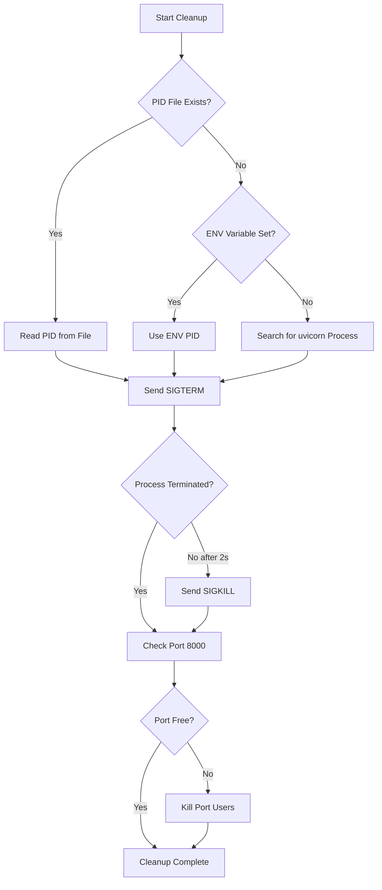

# CI API Process Cleanup Documentation

## Overview
Ensures proper cleanup of background API processes in CI/CD pipelines to prevent resource leaks and orphaned processes.

## Problem Solved
Previously, the CI workflow would:
- Start uvicorn API server with `nohup ... &`
- Run tests
- Exit without terminating the API process

This could lead to:
- ❌ Orphaned processes consuming resources
- ❌ Port 8000 remaining occupied
- ❌ Memory leaks in CI runners
- ❌ Potential test failures due to port conflicts

## Solution Implemented

### 1. PID Tracking
When starting the API:
```yaml
nohup poetry run uvicorn ... &
API_PID=$!
echo $API_PID > api.pid
echo "API_PID=$API_PID" >> $GITHUB_ENV
```

### 2. Cleanup Step
Always runs (even if tests fail) using `if: always()`:
```yaml
- name: Cleanup API Process
  if: always()
  run: |
    # Cleanup logic...
```

### 3. Cleanup Strategy
1. **Read PID** from file or environment
2. **Graceful shutdown** with SIGTERM
3. **Force kill** if still running after 2 seconds
4. **Verify cleanup** by checking for remaining processes
5. **Clean port 8000** if still in use

## Files Added/Modified

### `.github/workflows/api-integration.yml`
- Modified API launch to save PID
- Added cleanup step with `if: always()`
- Added log upload on failure

### `scripts/cleanup_api_process.sh`
Standalone cleanup script with:
- Multiple PID detection methods
- Graceful shutdown with timeout
- Port 8000 verification
- Colored output for visibility
- Exit codes for CI integration

## Usage

### In GitHub Actions
Automatically runs after tests:
```yaml
- name: Cleanup API Process
  if: always()
  run: ./scripts/cleanup_api_process.sh
```

### Local Development
```bash
# Manual cleanup
./scripts/cleanup_api_process.sh

# With PID file
echo $PID > api.pid
./scripts/cleanup_api_process.sh

# With environment variable
API_PID=$PID ./scripts/cleanup_api_process.sh
```

## Cleanup Flow



## Benefits

### Reliability
- ✅ Guaranteed cleanup with `if: always()`
- ✅ Multiple fallback methods for finding PID
- ✅ Handles both graceful and forced termination

### Debugging
- ✅ Detailed logging of cleanup steps
- ✅ API logs uploaded as artifacts on failure
- ✅ Clear error messages

### Resource Management
- ✅ Prevents process accumulation
- ✅ Frees port 8000 reliably
- ✅ Reduces CI runner resource usage

## Exit Codes
- `0`: Successful cleanup
- `1`: Cleanup failed (some processes may remain)
- `130`: Cleanup interrupted (SIGINT/SIGTERM)

## Troubleshooting

### Process Not Found
If cleanup reports "No API process found":
1. Check if API started successfully
2. Verify PID was saved correctly
3. Check API logs for startup errors

### Port Still in Use
If port 8000 remains occupied:
1. Check for other services on port 8000
2. Use `lsof -i:8000` to identify process
3. Manually kill with `pkill -f uvicorn`

### Cleanup Fails
If cleanup fails repeatedly:
1. Check process permissions
2. Verify uvicorn process name pattern
3. Check for zombie processes

## Best Practices

1. **Always use cleanup step** with `if: always()`
2. **Save PID immediately** after starting process
3. **Use both file and env** for PID storage
4. **Log output** for debugging
5. **Verify port is free** after cleanup

## Related Issues
- Issue #14: Ensure CI cleans background API process