# Roccavina Water Infrastructure Architecture

## Overview

The Roccavina Water Infrastructure system is a comprehensive water monitoring and analytics platform designed for the Sardinian water utility company. The architecture follows a microservices pattern with multiple specialized components working together to provide real-time monitoring, anomaly detection, forecasting, and data visualization capabilities.

The system features a modern Next.js frontend with multi-tenant support, connected to a FastAPI backend that interfaces with PostgreSQL/TimescaleDB for operational data, Redis for caching, and Google BigQuery for data warehousing and machine learning models.

## System Architecture Overview

## Architecture Components

### 1. Data Layer

#### 1.1 PostgreSQL with TimescaleDB
- **Container**: `abbanoa-postgres`
- **Image**: `timescale/timescaledb:latest-pg14`
- **Purpose**: Primary operational database with time-series optimization
- **Features**:
  - TimescaleDB extensions for efficient time-series data storage
  - Hypertables for automatic partitioning of sensor readings
  - Continuous aggregates for performance optimization
  - Data retention policies for automatic data lifecycle management
- **Schema**: Initialized via `/src/infrastructure/database/postgres_schema.sql`

#### 1.2 Redis Cache
- **Container**: `abbanoa-redis`
- **Image**: `redis:7-alpine`
- **Purpose**: High-performance caching layer
- **Configuration**:
  - Append-only file persistence (`appendonly yes`)
  - Memory limit: 4GB with LRU eviction policy
  - Used for caching system metrics, latest readings, and frequently accessed data
- **Key Patterns**:
  - `system:metrics:{time_range}` - System-wide metrics
  - `node:{node_id}:latest` - Latest sensor readings per node
  - `cache:forecast:{node_id}:{metric}` - Forecast results

#### 1.3 Google BigQuery
- **External Service**: Google Cloud BigQuery
- **Purpose**: Data warehouse and ML platform
- **Features**:
  - Source of truth for historical data
  - ARIMA_PLUS models for time-series forecasting
  - Anomaly detection models
  - Large-scale data analytics

### 2. Processing Layer

#### 2.1 ETL Scheduler Service
- **Container**: `abbanoa-etl-scheduler`
- **Purpose**: Orchestrates all data synchronization and processing tasks
- **Scheduled Jobs**:
  1. **Daily Sync** (2 AM): Full data synchronization from BigQuery to PostgreSQL
  2. **Hourly Cache Refresh**: Updates Redis cache with latest metrics
  3. **Real-time Sync** (every 5 min): Syncs recent data for near real-time updates
  4. **Anomaly Detection** (every 15 min): Statistical analysis for anomaly detection
  5. **Data Quality Check** (6 AM daily): Validates data integrity and completeness
  6. **Network Efficiency ETL** (every 5 min): Collects meter efficiency data
  7. **Weekly Cleanup** (Sunday 3 AM): Removes old data per retention policies

```mermaid
gantt
    title ETL Scheduler Daily Timeline
    dateFormat HH:mm
    axisFormat %H:%M
    
    section Continuous
    Real-time Sync (5min)     :active, rt1, 00:00, 5m
    Real-time Sync            :active, rt2, after rt1, 5m
    Network Efficiency (5min)  :ne1, 00:00, 5m
    Network Efficiency        :ne2, after ne1, 5m
    Anomaly Detection (15min)  :crit, ad1, 00:00, 15m
    Anomaly Detection         :crit, ad2, after ad1, 15m
    
    section Hourly
    Cache Refresh             :done, cr1, 01:00, 10m
    Cache Refresh             :done, cr2, 02:00, 10m
    
    section Daily
    Daily Sync                :milestone, ds, 02:00, 0m
    Data Quality Check        :milestone, dq, 06:00, 0m
```

#### 2.2 ETL Init Service
- **Container**: `abbanoa-etl-init`
- **Purpose**: One-time initialization tasks
- **Tasks**:
  - Initial data migration from BigQuery to PostgreSQL
  - Redis cache initialization with historical data
  - Schema setup and validation

### 3. Application Layer

#### 3.1 Next.js Frontend Application
- **Framework**: Next.js 15.3.5 with React 19
- **Port**: 3001 (development)
- **Purpose**: Modern, multi-tenant frontend dashboard
- **Architecture**:
  - **App Router**: Next.js App Router with server and client components
  - **TypeScript**: Full type safety across the application
  - **Tailwind CSS v4**: Utility-first CSS framework
  - **Authentication**: Multi-tenant authentication with JWT tokens
  - **State Management**: React hooks and context providers

##### Frontend Routes:
- `/` - Main dashboard with water metrics
- `/enhanced-overview` - Enhanced system overview
- `/anomalies` - Anomaly detection and monitoring
- `/monitoring` - Real-time system monitoring
- `/auth/login` - Multi-tenant login
- `/auth/register` - User registration
- `/test` - Testing and debugging

##### Key Components:
- **Water Components**:
  - `WaterKPIRibbon`: Key performance indicators display
  - `FlowAnalyticsChart`: Flow rate analytics with Recharts
  - `NetworkPerformanceAnalytics`: Network efficiency metrics
  - `SystemHealthGauges`: System health indicators
- **Layout Components**:
  - `LayoutWrapper`: Main layout with sidebar navigation
  - `Header`: Top navigation with tenant switcher
  - `Sidebar`: Navigation menu
  - `TenantSwitcher`: Multi-tenant context switching
- **Feature Components**:
  - `MetricsGrid`: Dashboard metrics display
  - `RecentAnomalies`: Real-time anomaly alerts
  - `ProtectedRoute`: Route protection for authenticated users

##### API Integration:
- **API Client** (`/lib/api/client.ts`):
  - Centralized API client with automatic token management
  - Request/response interceptors
  - Automatic token refresh on 401
  - Multi-tenant headers (`X-Tenant-ID`)
- **Proxy Route** (`/api/proxy/[...path]`):
  - Next.js API routes for backend proxying
  - Handles CORS and mixed content issues
  - Forwards all requests to backend API
- **Services Layer**:
  - `auth.service.ts`: Authentication operations
  - `dashboard.service.ts`: Dashboard data fetching
  - `anomaly.service.ts`: Anomaly management

#### 3.2 FastAPI Backend Service
- **Path**: `/src/presentation/api/app_postgres.py`
- **Port**: 8000 (default)
- **Purpose**: RESTful API backend
- **Features**:
  - PostgreSQL-based data access
  - CORS support for frontend integration
  - Async request handling with asyncpg
  - Connection pooling for performance

##### API Endpoints:
- **Dashboard**:
  - `GET /api/v1/dashboard/summary` - System-wide metrics
  - `GET /api/v1/nodes` - List all monitoring nodes
  - `GET /api/v1/nodes/{node_id}/readings` - Node sensor readings
- **Anomalies**:
  - `GET /api/v1/anomalies` - Recent anomaly list
- **Authentication**:
  - `POST /api/v1/auth/login` - User login
  - `GET /api/v1/auth/me` - Current user info
  - `GET /api/v1/auth/tenants` - User's tenants
  - `GET /api/v1/tenants/current` - Current tenant info

### 4. Infrastructure Layer

#### 4.1 Nginx Reverse Proxy
- **Container**: `abbanoa-nginx`
- **Ports**: 80 (HTTP), 443 (HTTPS)
- **Purpose**: 
  - SSL termination
  - Load balancing
  - Request routing
  - Static file serving
  - Security headers

#### 4.2 Monitoring Stack

##### Prometheus
- **Container**: `abbanoa-prometheus`
- **Port**: 9090
- **Purpose**: Metrics collection and storage
- **Targets**:
  - Application metrics
  - Database performance metrics
  - System resource utilization

##### Grafana
- **Container**: `abbanoa-grafana`
- **Port**: 3000
- **Purpose**: Monitoring dashboards and alerting
- **Features**:
  - Pre-configured dashboards for all services
  - Alert rules for system health
  - Integration with Prometheus data source

### 5. Network Architecture

#### Docker Network
- **Name**: `abbanoa-network`
- **Driver**: bridge
- **Purpose**: Isolated network for all services
- **Security**: Internal communication only, external access via Nginx

### 6. Data Volumes

Persistent storage for stateful services:
- `postgres-data`: PostgreSQL database files
- `redis-data`: Redis persistence files
- `prometheus-data`: Prometheus metrics storage
- `grafana-data`: Grafana configurations and dashboards

## Data Flow Architecture

### 1. Data Ingestion Flow

### 2. Real-time Processing Flow

### 3. User Request Flow

### 4. Authentication Flow

## Security Architecture

### Authentication & Authorization
- Multi-tenant support with tenant isolation
- Role-based access control (RBAC)
- JWT token-based authentication
- Session management in Redis

### Network Security
- All services isolated in Docker network
- External access only through Nginx
- SSL/TLS encryption for all external communication
- Environment-based configuration management

### Data Security
- Credentials stored in separate volume mounts
- Google Cloud service account for BigQuery access
- PostgreSQL connection encryption
- Redis password authentication

## Scalability & Performance

### Horizontal Scaling
- Stateless application services (Next.js, FastAPI)
- Load balancing through Nginx
- Redis cluster support ready
- PostgreSQL read replicas support
- Next.js Edge Runtime compatibility

### Performance Optimization
- TimescaleDB continuous aggregates
- Redis caching for frequent queries
- Parallel ETL processing
- Optimized query patterns

### Resource Management
- Container resource limits
- Memory-optimized Redis configuration
- Connection pooling for databases
- Scheduled job optimization

## Deployment Architecture

### Production Environment
- All services containerized with Docker
- Docker Compose orchestration
- Health checks for all services
- Automatic restart policies
- Volume-based data persistence

### Environment Configuration
- Environment variables for all configurations
- Separate credential management
- Configurable ports and resources
- Feature flags for functionality toggles
- Next.js configuration:
  - CORS headers for API integration
  - Proxy configuration for backend communication
  - Environment-specific builds
  - Turbopack for faster development

## Monitoring & Observability

### Application Monitoring
- Performance metrics collection
- Request/response tracking
- Error rate monitoring
- Custom business metrics

### Infrastructure Monitoring
- Container resource usage
- Database performance metrics
- Cache hit/miss rates
- Network latency tracking

### Alerting
- Grafana alert rules
- Anomaly detection alerts
- System health alerts
- Data quality alerts

## Development & Extension Points

### Adding New Features
1. New data sources: Extend ETL pipeline
2. New visualizations: Add React components to Next.js
3. New APIs: Extend FastAPI service
4. New models: Deploy to BigQuery ML
5. New routes: Add pages in Next.js app directory

### Integration Points
- REST API for external systems
- Redis pub/sub for real-time events
- PostgreSQL for custom queries
- BigQuery for advanced analytics

### Component Interaction Diagram

## Future Architecture Enhancements

### Planned Improvements
1. Kubernetes deployment for better orchestration
2. Apache Kafka for real-time streaming
3. Machine learning model serving layer
4. GraphQL API for flexible queries
5. Multi-region deployment support
6. Enhanced caching strategies
7. Event-driven architecture components
8. WebSocket support for real-time updates
9. Server-Sent Events (SSE) for live data streaming
10. Progressive Web App (PWA) capabilities