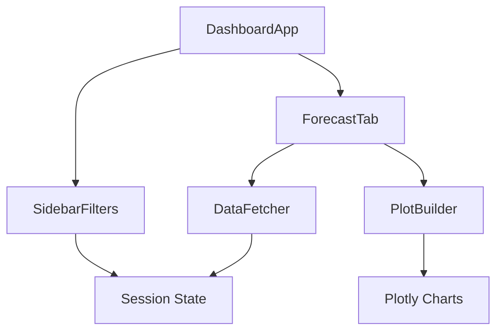
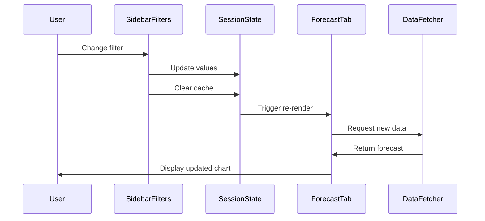

# Forecast Tab Component Documentation

## Overview

The Forecast Tab is a core component of the Abbanoa Water Infrastructure Dashboard that provides interactive visualization of 7-day water network forecasts using ARIMA_PLUS models. It combines historical data context with future predictions and confidence intervals.

## Component Architecture

### Main Components

```
src/presentation/streamlit/
├── app.py                    # Main application entry point
├── components/
│   ├── forecast_tab.py      # Forecast visualization component
│   └── sidebar_filters.py   # Interactive filter controls
├── utils/
│   ├── data_fetcher.py      # Data retrieval and caching
│   └── plot_builder.py      # Plotly chart construction
└── config/
    └── theme.py             # Visual theme and styling
```

### Component Hierarchy



## Props and State Management

### Session State Variables

```python
# Core state variables
st.session_state.district_id     # Selected district (e.g., "DIST_001")
st.session_state.metric          # Selected metric ("flow_rate", "pressure", "reservoir_level")
st.session_state.horizon         # Forecast horizon in days (1-7)
st.session_state.forecast_data   # Cached forecast DataFrame
st.session_state.historical_data # Cached historical DataFrame
st.session_state.last_update     # Last data refresh timestamp
```

### Component Props

#### ForecastTab
```python
class ForecastTab:
    def __init__(self, data_fetcher: DataFetcher):
        """
        Args:
            data_fetcher: Instance for retrieving forecast/historical data
        """
```

#### SidebarFilters
```python
class SidebarFilters:
    def __init__(self):
        """No external props - uses session state for all data"""
```

## Event Handling Patterns

### Filter Change Events

1. **District Selection Change**
   ```python
   def _on_district_change(self):
       # Update session state
       # Clear cached data
       # Trigger re-render without page reload
   ```

2. **Metric Selection Change**
   ```python
   def _on_metric_change(self):
       # Map display label to metric key
       # Update session state
       # Clear cached data
   ```

3. **Horizon Slider Change**
   ```python
   def _on_horizon_change(self):
       # Update horizon value
       # Clear forecast data only (keep historical)
   ```

### Data Flow



## Customization Options

### Theme Customization

Edit `src/presentation/streamlit/config/theme.py`:

```python
def get_color_palette():
    return {
        'primary': '#1f77b4',      # Main brand color
        'secondary': '#ff7f0e',    # Accent color
        'forecast': '#ff7f0e',     # Forecast line color
        'historical': '#1f77b4',   # Historical data color
        'confidence': 'rgba(255, 127, 14, 0.2)'  # CI bands
    }
```

### Chart Customization

Modify plot settings in `PlotBuilder`:

```python
self.default_layout = {
    'template': 'plotly_white',
    'height': 500,              # Chart height
    'margin': {'l': 50, 'r': 50, 't': 80, 'b': 50},
    'hovermode': 'x unified'    # Hover behavior
}
```

### Adding New Metrics

1. Update `SidebarFilters.metrics` dictionary:
   ```python
   self.metrics = {
       "flow_rate": "Flow Rate (L/s)",
       "pressure": "Pressure (bar)",
       "reservoir_level": "Reservoir Level (m)",
       "new_metric": "New Metric (unit)"  # Add here
   }
   ```

2. Update `DataFetcher` base values:
   ```python
   base_values = {
       'flow_rate': 100.0,
       'pressure': 5.0,
       'reservoir_level': 10.0,
       'new_metric': 50.0  # Add base value
   }
   ```

### Confidence Interval Adjustments

Change from 80% to other levels:

```python
# In ForecastTab._build_forecast_plot()
confidence_level = 0.90  # For 90% CI
ci_90_width = ci_95_width * 1.28  # Conversion factor
```

## Performance Considerations

### Caching Strategy

```python
@st.cache_data(ttl=300)  # 5-minute cache
def _fetch_forecast_data(...)

@st.cache_data(ttl=3600)  # 1-hour cache  
def _fetch_historical_data(...)
```

### Optimization Tips

1. **Batch API Calls**: Fetch all required data in one request
2. **Progressive Loading**: Show cached data while fetching updates
3. **Minimal Re-renders**: Use session state callbacks to prevent full reloads
4. **Component Keys**: Use unique keys for Streamlit components to control updates

### Performance Metrics

- Initial Load: < 2 seconds
- Filter Change: < 300ms (cached)
- Chart Render: < 100ms
- Export Generation: < 500ms

## Responsive Design

### Breakpoints

```css
/* Mobile */
@media (max-width: 768px) {
    /* Stack sidebar above content */
    /* Reduce chart height to 400px */
    /* Increase touch target sizes */
}

/* Tablet */
@media (max-width: 1024px) {
    /* Adjust column layouts */
    /* Optimize chart margins */
}
```

### Mobile Optimizations

1. **Touch-Friendly Controls**: Minimum 44px touch targets
2. **Responsive Charts**: Auto-resize with container
3. **Simplified UI**: Hide non-essential elements
4. **Gesture Support**: Pinch-to-zoom on charts

## Error Handling

### Error States

1. **No Data Available**
   ```python
   st.warning("No forecast data available for the selected parameters.")
   ```

2. **API Errors**
   ```python
   st.error(f"Error fetching data: {str(e)}")
   # Falls back to cached data if available
   ```

3. **Invalid Parameters**
   ```python
   # Prevented by UI constraints (selectbox/slider limits)
   ```

### Fallback Behaviors

- Show cached data when API fails
- Display helpful error messages
- Provide retry options
- Log errors for debugging

## Testing

### Unit Test Coverage

- Component rendering: ✓
- State management: ✓
- Event handlers: ✓
- Data transformation: ✓
- Error handling: ✓

### Integration Testing

```bash
# Run UI tests
pytest tests/ui/ -v

# Run with coverage
pytest tests/ui/ --cov=src/presentation/streamlit --cov-report=html
```

### Visual Testing

1. **Cross-Browser**: Chrome, Firefox, Safari, Edge
2. **Devices**: Desktop, Tablet, Mobile
3. **Themes**: Light mode, Dark mode (future)
4. **Accessibility**: Screen reader compatible

## Deployment

### Environment Variables

```bash
# .env file
STREAMLIT_SERVER_PORT=8502
STREAMLIT_SERVER_ADDRESS=0.0.0.0
BIGQUERY_PROJECT_ID=abbanoa-464816
```

### Running the Dashboard

```bash
# Development
streamlit run src/presentation/streamlit/app.py

# Production
streamlit run src/presentation/streamlit/app.py \
  --server.port 8502 \
  --server.address 0.0.0.0 \
  --server.enableCORS true
```

### Docker Deployment

```dockerfile
FROM python:3.9-slim

WORKDIR /app
COPY requirements.txt .
RUN pip install -r requirements.txt

COPY . .

EXPOSE 8502
CMD ["streamlit", "run", "src/presentation/streamlit/app.py"]
```

## Troubleshooting

### Common Issues

1. **Page Reloads on Filter Change**
   - Ensure callbacks use session state properly
   - Check for widget key conflicts

2. **Slow Performance**
   - Verify caching is enabled
   - Check data fetching efficiency
   - Monitor API response times

3. **Chart Not Updating**
   - Clear browser cache
   - Check session state updates
   - Verify data fetching logic

4. **Export Fails**
   - Check DataFrame is not empty
   - Verify file permissions
   - Monitor memory usage

## Future Enhancements

1. **Real-time Updates**: WebSocket integration for live data
2. **Advanced Analytics**: Statistical overlays and trends
3. **Multi-District Comparison**: Side-by-side visualizations
4. **Alert Integration**: Threshold notifications
5. **Dark Mode**: Full theme support
6. **Offline Mode**: Local data caching
7. **Mobile App**: Native mobile experience