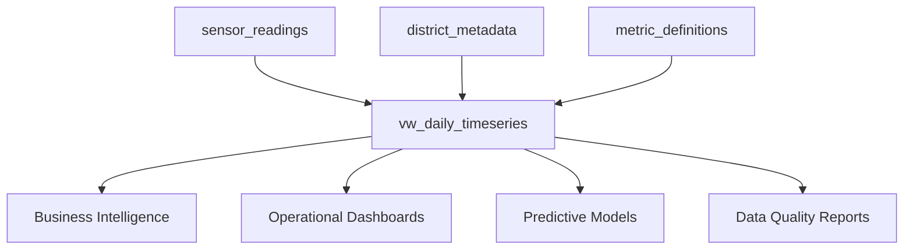

# SQL Views Documentation

This directory contains BigQuery view definitions for the Abbanoa water infrastructure monitoring system.

## Views Overview

### Core Analytics Views

#### `vw_daily_timeseries.sql`
**Purpose**: Daily aggregated sensor readings with gap-filling  
**Owner**: Data Engineering Team  
**Dependencies**: `raw_data.sensor_readings`, `reference.district_metadata`, `reference.metric_definitions`  
**Performance**: < 1 second for 5 years of data  
**Update Frequency**: Real-time (reflects latest raw data)

**Key Features**:
- Complete date coverage with gap-filling logic
- Statistical aggregations (avg, min, max, percentiles)
- Data quality metrics and flags
- Forward-filling for operational continuity
- Optimized for time-series analysis

**Common Use Cases**:
- Daily operational reporting
- Trend analysis and forecasting
- Data quality monitoring
- Anomaly detection input data
- Business intelligence dashboards

## Development Guidelines

### SQL Standards

1. **Comments**: Include header comments with purpose, owner, and dependencies
2. **CTEs**: Use descriptive names for Common Table Expressions
3. **Performance**: Always consider partition pruning and clustering
4. **Formatting**: Follow company SQL style guide
5. **Testing**: Include comprehensive unit tests

### Naming Conventions

- **Views**: Prefix with `vw_` followed by descriptive name
- **CTEs**: Use snake_case with descriptive names
- **Columns**: Use snake_case, avoid abbreviations
- **Functions**: Use built-in functions where possible

### Example Structure

```sql
/*
 * View: vw_example_view
 * Purpose: Brief description of view purpose
 * Owner: Team Name
 * Created: YYYY-MM-DD
 * Dependencies: List source tables
 */

CREATE OR REPLACE VIEW `project.dataset.vw_example_view`
OPTIONS(
  description="Detailed view description",
  labels=[("team", "data_engineering")]
)
AS

WITH descriptive_cte AS (
  -- Comments explaining logic
  SELECT
    column1,
    column2,
    -- Derived calculations with comments
    CASE WHEN condition THEN value ELSE other_value END as derived_column
  FROM `source_table`
  WHERE filter_conditions
),

another_cte AS (
  -- More processing steps
  SELECT ...
)

-- Final select with clear column organization
SELECT
  -- Dimension columns first
  dimension1,
  dimension2,
  
  -- Measure columns
  metric1,
  metric2,
  
  -- Calculated fields
  derived_metric

FROM descriptive_cte
JOIN another_cte USING (common_key)
ORDER BY logical_ordering;
```

## Testing Strategy

### Unit Tests
- Located in `tests/sql/test_[view_name].sql`
- Test aggregation accuracy
- Validate gap-filling logic
- Check data quality flags
- Verify performance requirements

### Performance Tests
- Located in `tests/performance/benchmark_[view_name].py`
- Validate query execution times
- Test concurrent query handling
- Monitor resource usage

### Test Execution
```bash
# Run all view tests
./scripts/deploy/deploy_views.sh dev vw_daily_timeseries

# Run performance benchmarks
python3 tests/performance/benchmark_daily_view.py

# SQL syntax validation
bq query --dry_run --use_legacy_sql=false < sql/views/vw_daily_timeseries.sql
```

## Deployment Process

### 1. Development
```bash
# Create feature branch
git checkout -b data/new-view-feature

# Develop view
vim sql/views/vw_new_view.sql

# Create tests
vim tests/sql/test_vw_new_view.sql

# Test locally
./scripts/deploy/deploy_views.sh dev vw_new_view
```

### 2. Testing
```bash
# Deploy to staging
./scripts/deploy/deploy_views.sh staging vw_new_view

# Run comprehensive tests
python3 tests/performance/benchmark_new_view.py

# User acceptance testing
```

### 3. Production Deployment
```bash
# Deploy to production
./scripts/deploy/deploy_views.sh prod vw_new_view

# Monitor performance
# Set up alerting
# Update documentation
```

## Performance Optimization

### Best Practices

1. **Partition Pruning**: Always filter on partition columns
2. **Clustering**: Leverage clustering for filtered queries
3. **Approximation**: Use APPROX functions for percentiles
4. **Materialization**: Consider materialized views for heavy workloads
5. **Query Cache**: Enable caching for repeated queries

### Common Optimizations

```sql
-- Good: Uses partition pruning
WHERE DATE(timestamp) >= '2024-01-01'

-- Bad: Prevents partition pruning
WHERE timestamp >= '2024-01-01 00:00:00'

-- Good: Leverages clustering
WHERE district_id IN ('DIST_001', 'DIST_002')

-- Good: Efficient aggregation
SELECT 
  APPROX_QUANTILES(value, 100)[OFFSET(50)] as median

-- Bad: Expensive aggregation
SELECT PERCENTILE_CONT(value, 0.5) OVER () as median
```

### Performance Monitoring

- Query execution times tracked in `view_performance_benchmarks` table
- Automated alerts for queries exceeding SLA
- Monthly performance reviews and optimization

## Data Lineage

### Dependencies



### Impact Analysis

Before modifying views, consider downstream impacts:
- Business Intelligence dashboards
- Operational monitoring systems
- Data science models
- Automated reporting

## Security and Access Control

### Data Classification
- **Public**: Aggregated statistics
- **Internal**: Detailed operational data
- **Confidential**: Individual sensor readings
- **Restricted**: Customer-specific data

### Access Patterns
- **Data Analysts**: Read-only access to aggregated views
- **Operations Team**: Read access to all operational views
- **Data Engineers**: Full access for development and maintenance
- **Executive Dashboard**: Specific metrics only

## Troubleshooting

### Common Issues

1. **View Not Found**
   - Check deployment status
   - Verify dataset permissions
   - Confirm project/dataset names

2. **Query Timeouts**
   - Add date range filters
   - Check for missing WHERE clauses
   - Review query plan for efficiency

3. **Data Quality Issues**
   - Check source table data
   - Verify gap-filling logic
   - Review data_quality_flag distribution

4. **Performance Degradation**
   - Check partition pruning
   - Review clustering effectiveness
   - Monitor concurrent query load

### Support Contacts

- **Primary**: Data Engineering Team (data-engineers@abbanoa.com)
- **Secondary**: Platform Team (platform-team@abbanoa.com)
- **Emergency**: PagerDuty "Water Data Platform" service

## Contributing

### Adding New Views

1. Follow naming conventions (`vw_` prefix)
2. Include comprehensive documentation
3. Add unit and performance tests
4. Update this README
5. Request code review from Data Architecture team

### Modifying Existing Views

1. Assess backward compatibility impact
2. Create migration plan if breaking changes
3. Update all dependent documentation
4. Coordinate with stakeholders
5. Plan phased deployment

### Code Review Checklist

- [ ] SQL follows style guide
- [ ] Performance optimizations applied
- [ ] Comprehensive comments included
- [ ] Unit tests cover edge cases
- [ ] Performance benchmarks passing
- [ ] Documentation updated
- [ ] Dependencies documented
- [ ] Security considerations addressed

## Related Documentation

- [Data Dictionary](../docs/data-dictionary/)
- [BigQuery Configuration](../config/bigquery/)
- [Testing Guidelines](../tests/README.md)
- [Deployment Guide](../scripts/deploy/README.md)